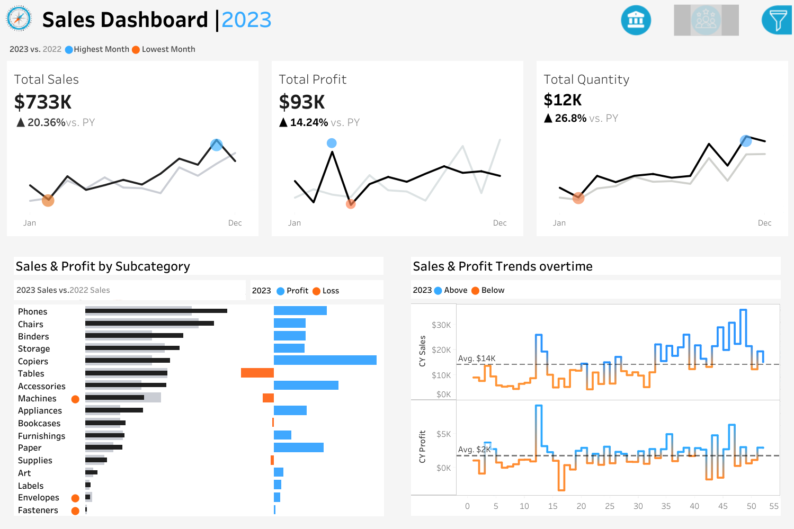

# 📊 Sales Dashboard 2023

## Overview
This project presents an interactive Sales Dashboard developed in Power BI to analyze sales performance, profit trends, and quantity metrics.

## Features

- Total Sales Analysis
- Profit Tracking
- Quantity Monitoring
- Year-over-Year Comparison
- Sales & Profit by Subcategory
- Monthly Trend Analysis
- Highest and Lowest Performing Months

## Dashboard Preview

## Key Insights

- Total Sales: $733K
- Total Profit: $93K
- Total Quantity: 12K
- Sales Growth: 20.36%
- Profit Growth: 14.24%
- Quantity Growth: 26.8%

## Tools Used

- Power BI
- Microsoft Excel
- Data Visualization
- Business Intelligence

## Author

Poorvanshi Dixit
